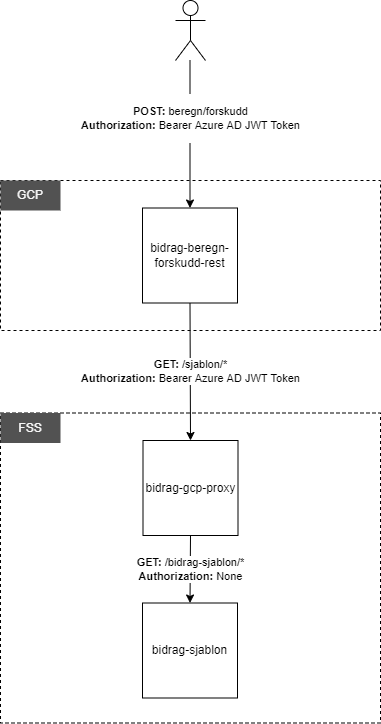

# bidrag-beregn-forskudd-rest

Mikrotjeneste / Rest-API for beregning av bidragsforskudd, som er satt opp til å kjøre på NAIS i GCP.

### Tilgjengelige tjenester (endepunkter) 
Request-URL: [https://bidrag-beregn-forskudd-rest.dev.intern.nav.no/beregn/forskudd](https://bidrag-beregn-forskudd-rest.dev.intern.nav.no/beregn/forskudd)
Swagger-UI: [https://bidrag-beregn-forskudd-rest.dev.intern.nav.no/](https://bidrag-beregn-forskudd-rest.dev.intern.nav.no/)

### Input/output
Tjenesten kalles med en POST-request, hvor input-dataene legges i request-bodyen. For nærmere detaljer, se Swagger.

### Avhengigheter
`bidrag-beregn-forskudd-rest` kaller maven-modul `bidrag-beregn-forskudd-core`, hvor selve beregningen gjøres. Sjablonverdier hentes ved å kalle tjenesten `bidrag-sjablon` via proxy tjenesten `bidrag-gcp-proxy`.

### Sikkerhet
Tjenesten er sikret med Azure AD JWT tokens. Konsumenter av tjenesten er derfor nødt til å registere seg som konsument av tjenesten, og benytte gyldig token i `Authorization` header ved REST-kall. Dersom en ny applikasjon skal ha tilgang må dette også registreres i henholdsvis `nais.yaml` og `nais-p.yaml` i denne applikasjonen.

### Funksjonalitet
Tjenesten tar inn parametre knyttet til bidragsmottaker og barnet det søkes om bidrag for. Sjablonverdier som er nødvendige for beregningen hentes fra tjenesten `bidrag-sjablon` via proxy tjenesten `bidrag-gcp-proxy`.

Det gjøres en mapping fra rest-tjenestens input-grensesnitt til core-tjenestens input-grensesnitt før denne kalles. Ifbm. med mappingen gjøres det en kontroll på felter som ikke kan inneholde null. Hvis noen av disse inneholder null, kastes UgyldigInputException, som resulterer i statuskode 400 (Bad Request). Ved feil i kall for henting av sjablonverdier kastes `BidragGcpProxyConsumerException`, som resulterer i statuskode 500 (Internal Server Error). Kall til beregningen (i core-modulen), kan også resultere i feil som vil kaste exception (avhengig av type feil).

### Overordnet arkitektur

